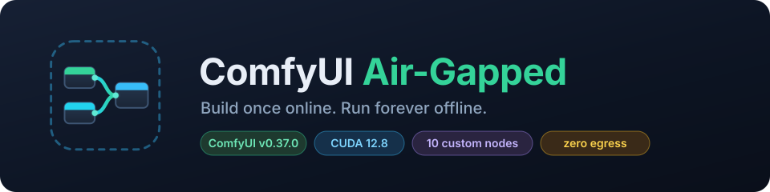

<p align="center">
  
</p>

<p align="center">
  <b>Build a fully self-contained ComfyUI image on a connected machine.<br>
  Ship it as a file. Run it on a server with no internet — forever.</b>
</p>

<p align="center">
  
  
  
  
  
</p>

---

## What this is

ComfyUI does not survive an air gap on its own. It and its custom nodes reach
the network at install time **and** — the part that catches people — the first
time a node actually executes. A build that completes cleanly can still fail
weeks later, the moment someone drags a ControlNet preprocessor onto the canvas.

This repository moves every one of those network accesses to build time on a
connected machine, then **proves** none remain by running the finished image
with no network stack at all.

```
┌─ INTERNET MACHINE ──────────────┐        ┌─ AIR-GAPPED MACHINE ────────────┐
│                                 │        │                                 │
│  ./scripts/build.sh             │        │  ./scripts/load_image.sh <file> │
│  ./scripts/verify_offline.sh    │  USB   │  docker compose up -d           │
│  ./scripts/export_image.sh  ────┼───────▶│                                 │
│                                 │        │  no build · no downloads        │
└─────────────────────────────────┘        └─────────────────────────────────┘
```

> [!IMPORTANT]
> **There is no `docker build` on the air-gapped machine.** Building re-runs
> `git clone` and `pip install` — exactly what this eliminates. `docker load`
> restores the image byte-for-byte. The run-side `docker-compose.yml`
> deliberately has no `build:` key so this cannot happen by accident.

**Contents**
[Requirements](#requirements) ·
[Quick start](#quick-start) ·
[Phase A — Build](#phase-a--build-internet-machine) ·
[Phase B — Verify](#phase-b--verify-offline-readiness) ·
[Phase C — Export](#phase-c--export-and-transfer) ·
[Phase D — Deploy](#phase-d--load-and-run-air-gapped-machine) ·
[Verification](#verification-on-the-air-gapped-host) ·
[Operations](#operations) ·
[Docs](#documentation)

---

## Requirements

**Internet machine** — Ubuntu, Docker Engine, NVIDIA GPU + Container Toolkit,
~60 GB free, and `zstd` (`sudo apt install zstd`).

**Air-gapped machine** — Ubuntu, Docker Engine, NVIDIA driver + Container
Toolkit, and room for the image plus your models.

> [!WARNING]
> **Check the target's driver before you build.** A CUDA/driver mismatch is the
> one failure that only shows up *after* the transfer. Run `nvidia-smi` on the
> **air-gapped** machine and read the CUDA version:
>
> | Target driver | `CUDA_IMAGE` | `TORCH_INDEX` |
> |---|---|---|
> | ≥ 525 (CUDA 12.x) | `nvidia/cuda:12.8.1-cudnn-runtime-ubuntu24.04` *(default)* | `https://download.pytorch.org/whl/cu128` |
> | 525–535, conservative | `nvidia/cuda:12.4.1-cudnn-runtime-ubuntu22.04` | `https://download.pytorch.org/whl/cu124` |
> | ≥ 530 | `nvidia/cuda:12.1.1-cudnn8-runtime-ubuntu22.04` | `https://download.pytorch.org/whl/cu121` |
>
> Set both in `.env`. They must agree with each other.

Confirm the toolkit works on both machines:

```bash
docker run --rm --gpus all nvidia/cuda:12.8.1-base-ubuntu24.04 nvidia-smi
```

---

## Quick start

```bash
git clone <this-repo> comfyui-airgap && cd comfyui-airgap
cp .env.example .env
$EDITOR .env                      # set PUID/PGID for the TARGET, and CUDA/torch

./scripts/build.sh                # 30-60 min, ~10-15 GB
./scripts/verify_offline.sh       # proves it runs with --network none
./scripts/export_image.sh         # writes ./dist
```

Copy `dist/` to the air-gapped machine, then:

```bash
./scripts/load_image.sh /media/usb/comfyui-airgap-v0.37.0.tar.zst
docker compose up -d
```

Open `http://<server-ip>:8188`.

---

## Phase A — Build (internet machine)

```bash
cp .env.example .env
```

The two settings that matter most:

```bash
# Must match the owner of ./models on the AIR-GAPPED host — not this machine.
PUID=1000
PGID=1000

# Must match the target's driver (see the table above).
CUDA_IMAGE=nvidia/cuda:12.8.1-cudnn-runtime-ubuntu24.04
TORCH_INDEX=https://download.pytorch.org/whl/cu128
```

Optionally adjust `custom_nodes.txt`, then re-pin:

```bash
./scripts/pin_custom_nodes.sh              # fill in missing pins
./scripts/pin_custom_nodes.sh --update     # re-pin everything to current HEAD
```

Already have a working ComfyUI install? Bring its nodes along:

```bash
rsync -a --exclude='.git' --exclude='__pycache__' \
  /path/to/ComfyUI/custom_nodes/  ./custom_nodes_local/
```

They install *before* the pinned ones and win on a name collision. See
[docs/CUSTOM-NODES.md](docs/CUSTOM-NODES.md).

Build:

```bash
./scripts/build.sh
```

30–60 minutes, ~10–15 GB. Output is tee'd to `build.log`; the resolved package
set lands in `requirements.lock.txt`.

---

## Phase B — Verify offline readiness

Still on the internet machine.

```bash
./scripts/verify_offline.sh
```

`--network none` gives the container a loopback interface and nothing else — no
DNS, no route out. It is a faithful simulation of the air-gapped server, and the
only cheap chance to find a missing asset. Five checks:

1. PyTorch imports and sees the GPU
2. The server boots and answers `/system_stats`
3. All custom nodes registered
4. No import failures or connection errors in the log
5. ComfyUI-Manager really is in `network_mode = offline`

```
Result: 5 passed, 0 failed
Image is air-gap ready.
```

> [!NOTE]
> If check 4 reports connection errors, a node downloads something lazily. Add
> it to `scripts/prewarm_models.sh`, rebuild, re-verify. This is a normal part
> of onboarding a new node — see [docs/CUSTOM-NODES.md](docs/CUSTOM-NODES.md).

Finding this here costs minutes. Finding it after the image is behind the air
gap costs a full round trip.

---

## Phase C — Export and transfer

```bash
./scripts/export_image.sh
```

Re-runs verification, then writes `./dist/`:

| File | Contents |
|---|---|
| `comfyui-airgap-v0.37.0.tar.zst` | the image |
| `comfyui-airgap-v0.37.0-repo.tar.gz` | compose file, scripts, config, docs |
| `comfyui-airgap-v0.37.0-models.tar` | your model weights, if `./models` is populated |
| `SHA256SUMS` | integrity check for all of the above |

FAT32 stick (4 GB per-file limit):

```bash
SPLIT_SIZE=3900M ./scripts/export_image.sh
```

Copy the **entire `dist/` directory**, `SHA256SUMS` included.

### Models

Models are bind-mounted, not baked in — that keeps the image ~10–15 GB instead
of 50–100+ GB and lets you add checkpoints later without rebuilding. Put them
under `./models` before exporting, or copy them to the target separately.

```
models/
├── checkpoints/        *.safetensors
├── loras/
├── vae/
├── controlnet/
├── clip/  clip_vision/  text_encoders/
├── unet/  diffusion_models/
├── upscale_models/
└── embeddings/
```

---

## Phase D — Load and run (air-gapped machine)

```bash
# 1. Unpack the repo
mkdir -p ~/comfyui && cd ~/comfyui
tar -xzf /media/usb/comfyui-airgap-v0.37.0-repo.tar.gz

# 2. If the image was split, rejoin it
#    cat /media/usb/comfyui-airgap-v0.37.0.tar.zst.part-* \
#      > /media/usb/comfyui-airgap-v0.37.0.tar.zst

# 3. Verify checksum, load the image, fix ownership — one step
./scripts/load_image.sh /media/usb/comfyui-airgap-v0.37.0.tar.zst

# 4. Unpack models
tar -xf /media/usb/comfyui-airgap-v0.37.0-models.tar

# 5. Run
docker compose up -d
docker compose logs -f
```

Open `http://<server-ip>:8188`.

<details>
<summary>The equivalent manual commands</summary>

```bash
sha256sum -c SHA256SUMS                                   # BEFORE loading
zstd -dc comfyui-airgap-v0.37.0.tar.zst | docker load     # or: docker load -i <.tar.gz>
cp .env.example .env
printf 'PUID=%s\nPGID=%s\n' "$(id -u)" "$(id -g)" >> .env
sudo chown -R "$(id -u):$(id -g)" models input output user
docker compose up -d
```
</details>

---

## Verification on the air-gapped host

```bash
docker compose ps                                    # State should be "healthy"
curl -fsS http://localhost:8188/system_stats | head
docker exec comfyui nvidia-smi                       # GPU visible in-container
docker compose logs | grep -Ei "IMPORT FAILED|Traceback|ConnectionError"
```

Then in the browser: load a default workflow, pick a checkpoint, queue one
generation, and confirm the result appears in `./output` on the host.

**Strongest proof** — run with the network namespace removed entirely:

```bash
docker compose down
docker run -d --name comfy-proof --network none --gpus all --shm-size=8gb \
  -v "$PWD/models:/app/ComfyUI/models" \
  -v "$PWD/output:/app/ComfyUI/output" \
  comfyui-airgap:v0.37.0
docker logs -f comfy-proof
```

If it serves normally with no network stack at all, the air gap is satisfied.
Clean up with `docker rm -f comfy-proof`.

---

## Operations

### Adding a custom node

```bash
# On the INTERNET machine — preferred, stays reproducible:
echo "https://github.com/author/SomeNode.git" >> custom_nodes.txt
./scripts/pin_custom_nodes.sh
./scripts/build.sh
./scripts/verify_offline.sh     # catches lazy downloads the new node makes
./scripts/export_image.sh
```

Then re-transfer and `./scripts/load_image.sh` on the target. For private or
modified nodes, drop them in `custom_nodes_local/` instead.

> [!NOTE]
> ComfyUI-Manager's install/update buttons do nothing on the air-gapped host.
> That is deliberate — it is forced into `network_mode = offline` so it does not
> stall at startup trying to reach GitHub.

### Adding models

No rebuild needed — models are bind-mounted. Copy them into `./models/...` on
the air-gapped host and `docker compose restart`.

### Upgrading ComfyUI

Bump `COMFYUI_REF` and `IMAGE_TAG` in `.env`, re-pin nodes, rebuild, verify,
re-transfer. Keep the previous image tag loaded on the target — rollback is then
just pointing `IMAGE_TAG` back and running `docker compose up -d`.

---

## Documentation

| Document | Covers |
|---|---|
| [docs/ARCHITECTURE.md](docs/ARCHITECTURE.md) | How the offline hardening works, build ordering, layout, design trade-offs |
| [docs/CUSTOM-NODES.md](docs/CUSTOM-NODES.md) | Pinned vs local nodes, lazy downloads, prewarming, the default set |
| [docs/TROUBLESHOOTING.md](docs/TROUBLESHOOTING.md) | Build, verification, transfer and runtime problems |

---

## Repository layout

| Path | Role | Runs on |
|---|---|---|
| `Dockerfile` | the image definition | internet |
| `docker-compose.build.yml` | build config (has `build:`) | internet |
| `docker-compose.yml` | run config (**no** `build:`) | air-gapped |
| `custom_nodes.txt` | pinned node list | internet |
| `custom_nodes_local/` | your own node folders (optional) | internet |
| `config/manager-config.ini` | ComfyUI-Manager offline config | baked in |
| `scripts/pin_custom_nodes.sh` | resolve commit SHAs | internet |
| `scripts/install_local_nodes.sh` | build-time install of your folder | inside build |
| `scripts/install_custom_nodes.sh` | build-time pinned node install | inside build |
| `scripts/prewarm_models.sh` | build-time lazy-asset fetch | inside build |
| `scripts/entrypoint.sh` | seeds mounts, starts ComfyUI | inside container |
| `scripts/build.sh` | build + lockfile | internet |
| `scripts/verify_offline.sh` | `--network none` proof | internet |
| `scripts/export_image.sh` | save + checksum + split | internet |
| `scripts/load_image.sh` | verify + load + setup | air-gapped |

---

## Credits

Built on [Comfy-Org/ComfyUI](https://github.com/Comfy-Org/ComfyUI) and the work
of every custom-node author listed in `custom_nodes.txt`.
